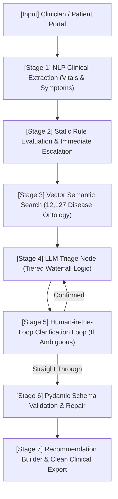

# TriageAI Clinical Assistant

**GitHub Repository:** `triage-ai-clinical-assistant`  
**Core Mission:** A professional-grade, highly resilient clinical decision support system and automated triage engine designed to enhance patient safety, standardize triage severity, and provide multi-layered fallback mechanisms against inference failures.

---

## 🏗️ Technical Architecture Overview

The system processes incoming patient descriptions through a highly decoupled, stateful graph using **LangGraph**. The workflow follows a strict medical-grade data pipeline:



---

## 🛠️ Deep Dive: The Processing Pipeline

### 1. Clinical Extraction & Entity Mapping
*   **Module:** `pipeline/extractor.py`
*   Normalizes messy clinical input to pull out key entities (symptoms, comorbidities, existing medications) using a Clinical NLP keyword fallback parser.
*   Extracts vital sign values and computes a **Data Completeness Score** to identify crucial missing parameters.

### 2. Risk Engine & Hard Rules
*   **Module:** `pipeline/risk_engine.py`
*   Evaluates vital signs directly against standard medical parameters (e.g., severe bradycardia, tachycardia, or critical hypoxemia).
*   Can bypass normal inference to immediately fast-track critical cases to high-urgency triage.

### 3. Vector-Search RAG
*   **Module:** `rag/retriever.py`
*   Leverages a **FAISS vector database** indexed against a 12,127-entry human disease ontology.
*   Returns raw disease profiles, ICD codes, and exact **L2 Distance scores**, which are directly passed both to the LLM context and the user-facing clinician UI.

### 4. Advanced Waterfall LLM Router
*   **Module:** `pipeline/llm_router.py`
*   Ensures extreme operational resilience through multi-provider, multi-tier fallback routing:
    1.  **Tier 1:** Groq (Llama-3.3-70b-versatile)
    2.  **Tier 2:** MedGemma-27B
    3.  **Tier 3:** Gemini-2.5-Flash

### 5. Clinician Validation & HITL Pauses
*   **Module:** `pipeline/langgraph/nodes.py`
*   If the extraction score drops or the inputs present deep ambiguity, the state machine leverages LangGraph's checkpoint mechanism to emit a `pending_clarification` interrupt.
*   The clinician is prompted directly for clarification answers before the pipeline resumes.

---

## 📂 Codebase Layout

```text
triageai/
├── db/                     # Case history persistence via SQLite
├── frontend/               # Multi-page Streamlit portal
│   ├── page_about.py       # Developer documentation & setup notes
│   ├── page_history.py     # High-fidelity case logs with deleting/reviewing
│   ├── page_status.py      # Real-time inference & model health metrics
│   ├── page_triage.py      # Core clinical assessment interface
│   ├── test_cases.py       # Extracted benchmark testing scenarios
│   └── ui_helpers.py       # Custom visual components, colors, and download buttons
├── models/                 # Pydantic core data schemas
│   ├── patient.py          # Demographics, complaints, and vitals schema
│   └── triage_output.py    # Structured output schemas (TriageResult, RecommendationDetail)
├── pipeline/               # The core logic of the triage machine
│   ├── langgraph/          # Stateful Graph, nodes, and router definitions
│   ├── dependencies.py     # Application-wide thread-safe singleton setups
│   ├── extractor.py        # Clinical keyword Extraction engine
│   ├── risk_engine.py      # Deterministic vital sign rule evaluation
│   └── safety_validator.py # Automatic fallback generation for schema repair
├── rag/                    # FAISS vector database initialization scripts
├── tests/                  # Pytest unit tests and benchmarking scenarios
└── utils/                  # Utility scripts
    ├── logger.py           # Clinical-grade transaction logger
    ├── prompts.py          # Decoupled prompts for easy clinician maintenance
    └── report_generator.py # Formats the plain-text clinical handoff summary for download
```

---

## 🚀 Step-By-Step Setup & Execution

### 1. Prerequisites
Ensure you are running **Python 3.10** or higher. Clone the repository and configure a Python virtual environment:

```bash
# Initialize and activate a local virtual environment
python -m venv venv
.\venv\Scripts\Activate.ps1   # Windows PowerShell

# Install required dependencies
pip install -r requirements.txt
```

### 2. Environment Setup
Create a `.env` file in the root directory to supply inference API keys:

```ini
# Core Configuration Variables
GROQ_API_KEY=your_groq_api_key_here
HF_TOKEN=your_huggingface_token_here
GEMINI_API_KEY=your_gemini_api_key_here
```

### 3. Launching the Backend Server
Start the core REST API through Uvicorn:
```bash
uvicorn main:app --host 0.0.0.0 --port 8000 --reload
```

### 4. Running the Frontend Dashboard
In a secondary terminal, launch the Streamlit frontend:
```bash
streamlit run streamlit_app.py
```

---

## 🎯 Clinical Testing Workflow
Review the comprehensive test cases inside [ARCHITECTURE_DELIVERABLE.md](ARCHITECTURE_DELIVERABLE.md) to validate extraction, rule triggering, and proper triage escalation.
